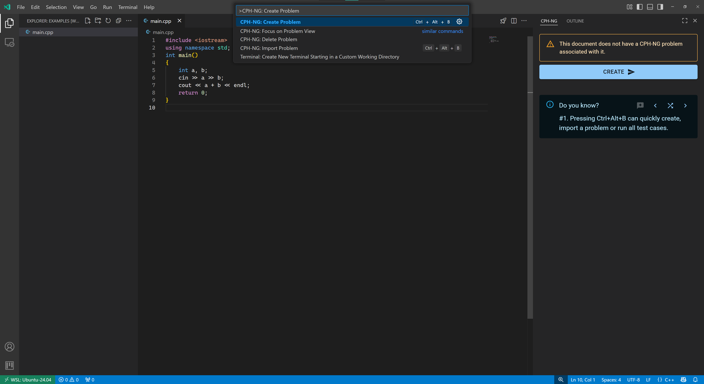
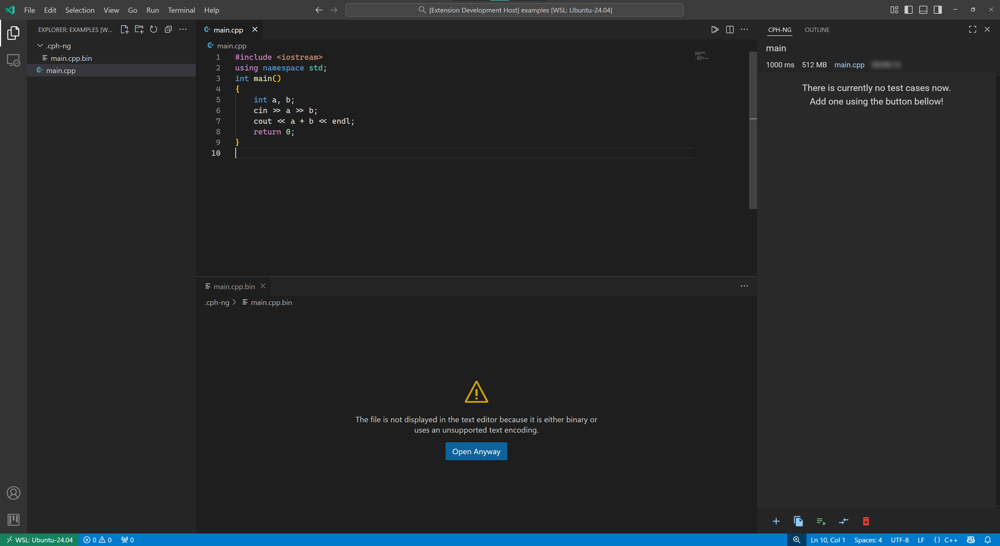
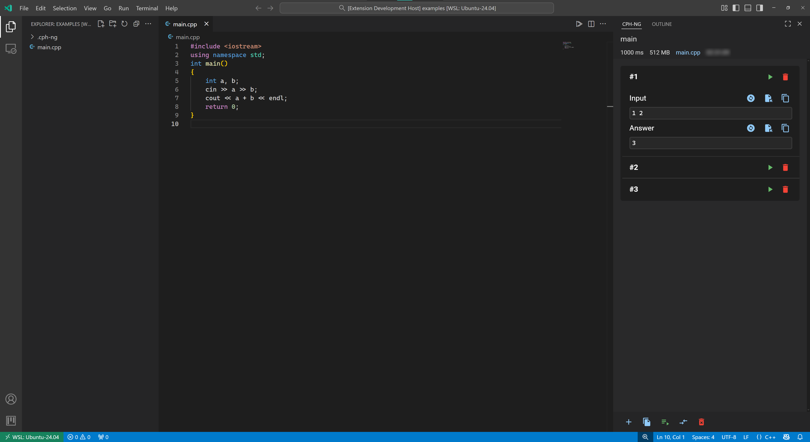
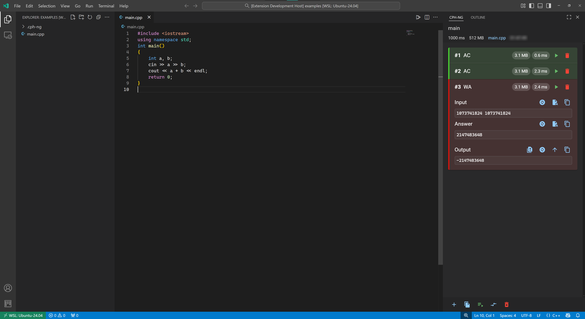

# Quick Start

This guide will help you get started with CPH-NG in minutes. For detailed
information about all features, see the [Feature Guide](features.md).

## Installation

First, the CPH-NG VS Code extension must be installed in your environment. You
can install it directly by clicking this link:
[Install CPH-NG](vscode:extension/langningchen.cph-ng). Please ensure you have
the latest version installed.

After installation, you'll find the extension's sidebar icon on the left side of
your VS Code window. Feel free to drag it to the right side if you prefer.

!!! tip "First Time Setup" Before creating your first problem, you may want to
configure compiler settings in
[Configuration](configuration.md#compilation-settings).

## Create a problem

A problem would be created after you click the `CREATE` button. You can do this
by using the command `CPH-NG: Create Problem` or pressing `Ctrl+Alt+B` as a
shortcut.

## Add test cases

Once the problem is created,the buttons below are able to be used.

The leftmost button is used to **create a single test case**. You will need to
manually enter the input data and the expected answer (output).

- Tip: CPH-NG also supports **loading test cases from zipped files or specific
  directories**, which is a great option for managing large datasets.

## Run test cases

- To run **a single test case**, click the green play button next to that test
  case.

- To run **all test cases simultaneously**, click the middle play button in the
  lower control panel.

CPH-NG would show you **the first judged test case which isn't accepted**
automatically.

If you load these test cases from files,the output would be also showed as
files.Drag or click them to show them in detailed.

**Now, you have already learned the basic usage of CPH-NG. Enjoy coding with
CPH-NG!**

## Next Steps

- Explore all features in the [Feature Guide](features/)
- Learn about [Configuration Options](configuration/)
- Check [Modules](modules.md) for additional functionality
- Visit [FAQ](faq.md) if you have questions
